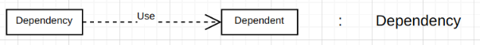

# Introduction to Dependency relationship
1. Preview  
    We have 2 classes here: Children, Parent  

2. Implementation  
    - Class Parent has the instance of Children(children) which presents 
who belongs to their parents
    - Here if parent class is exposed, the children instance belong to them will also be killed
3. Notation
    
    
    